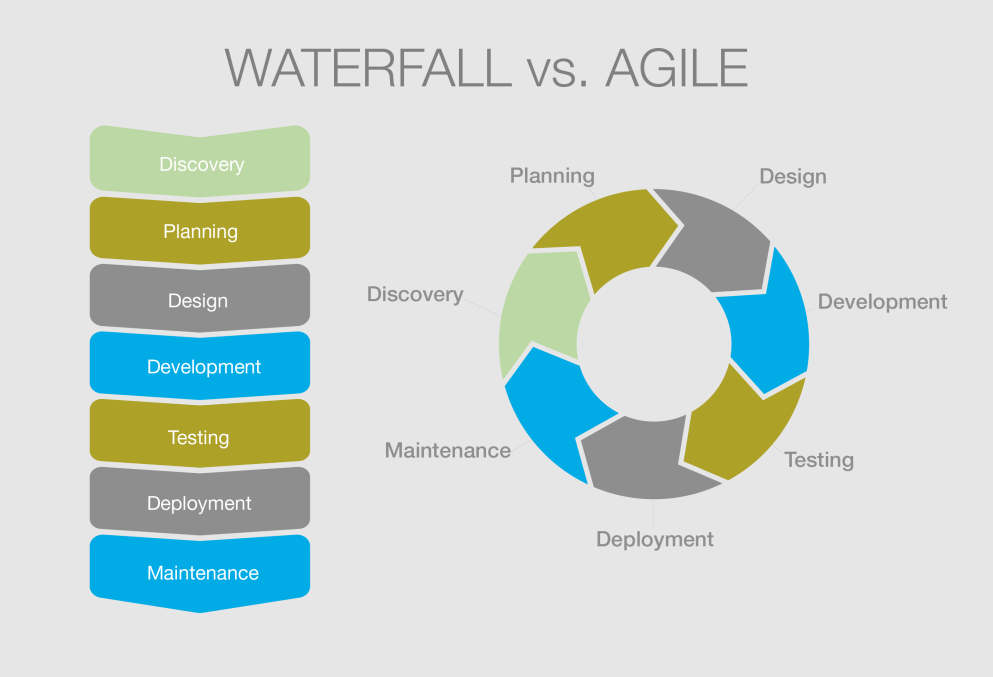

# Agile

Nell'ingegneria del software, l'espressione metodologia agile (o sviluppo agile del software, in inglese agile software development, abbreviato in ASD) si riferisce a un insieme di metodi di sviluppo del software emersi a partire dai primi anni 2000 e fondati su un insieme di principi comuni, direttamente o indirettamente derivati dai principi del "Manifesto per lo sviluppo agile del software" (Manifesto for Agile Software Development, impropriamente chiamato anche "Manifesto Agile") pubblicato nel 2001 da Kent Beck, Robert C.

I metodi agili si contrappongono al modello a cascata (waterfall model) e altri modelli di sviluppo tradizionali, proponendo un approccio meno strutturato e focalizzato sull'obiettivo di consegnare al cliente, in tempi brevi e frequentemente (early delivery/frequent delivery), software funzionante e di qualità.

Fra le pratiche promosse dai metodi agili ci sono la formazione di team di sviluppo piccoli, poli-funzionali e auto-organizzati, lo sviluppo iterativo e incrementale, la pianificazione adattiva, e il coinvolgimento diretto e continuo del cliente nel processo di sviluppo.

## Il manifesto

La gran parte dei metodi agili tenta di ridurre il rischio di fallimento sviluppando il software in finestre di tempo limitate chiamate iterazioni che, in genere, durano qualche settimana. Ogni iterazione è un piccolo progetto a sé stante e deve contenere tutto ciò che è necessario per rilasciare un piccolo incremento nelle funzionalità del software: pianificazione (planning), analisi dei requisiti, progettazione, implementazione, test e documentazione.

Anche se il risultato di ogni singola iterazione non ha sufficienti funzionalità da essere considerato completo deve essere pubblicato e, nel susseguirsi delle iterazioni, deve avvicinarsi sempre di più alle richieste del cliente. Alla fine di ogni iterazione il team deve rivalutare le priorità di progetto.

I metodi agili preferiscono la comunicazione in tempo reale, preferibilmente faccia a faccia, a quella scritta (documentazione). Il team agile è composto da tutte le persone necessarie per terminare il progetto software. Come minimo il team deve includere i programmatori ed i loro clienti (con clienti si intendono le persone che definiscono come il prodotto dovrà essere fatto: possono essere dei product manager, dei business analysts, o veramente dei clienti).
 
### Obiettivi
 
L'obiettivo è la piena soddisfazione del cliente. Il corretto uso di queste metodologie, inoltre, può consentire di abbattere i costi e i tempi di sviluppo del software, aumentandone la qualità. 

### Principi

- le persone e le interazioni sono più importanti dei processi e degli strumenti (ossia le relazioni e la comunicazione tra gli attori di un progetto software sono la miglior risorsa del progetto);
- è più importante avere software funzionante che documentazione (bisogna rilasciare nuove versioni del software ad intervalli frequenti, e bisogna mantenere il codice semplice e avanzato tecnicamente, riducendo la documentazione al minimo indispensabile);
- bisogna collaborare con i clienti oltre che rispettare il contratto (la collaborazione diretta offre risultati migliori dei rapporti contrattuali);
- bisogna essere pronti a rispondere ai cambiamenti oltre che aderire alla pianificazione (quindi il team di sviluppo dovrebbe essere pronto, in ogni momento, a modificare le priorità di lavoro nel rispetto dell'obiettivo finale).

In sintesi, il Manifesto Agile, sottolinea l'importanza dei su citati principi fermo restando il valore di processi, strumenti, documentazione, contratti e pianificazione.

### Pratiche

Le singole pratiche applicabili all'interno di una metodologia agile sono decine e dipendono essenzialmente dalle necessità dell'azienda e dall'approccio del project manager. Nella scelta però bisogna tenere conto delle caratteristiche di ogni pratica per i benefici che apporta e le conseguenze che comporta. Ad esempio, in Extreme Programming, si supplisce alla mancanza assoluta di qualsiasi forma di progettazione e documentazione con lo strettissimo coinvolgimento del cliente nello sviluppo e con la programmazione in coppia.

Introduzione al framework scrum: [Link Slide](https://www.slideshare.net/GiulioRoggero/introduzione-a-scrum-53424608)
