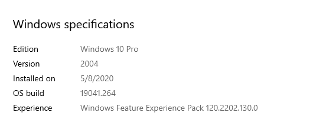
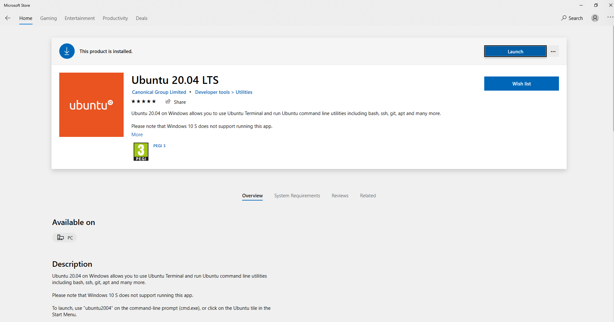
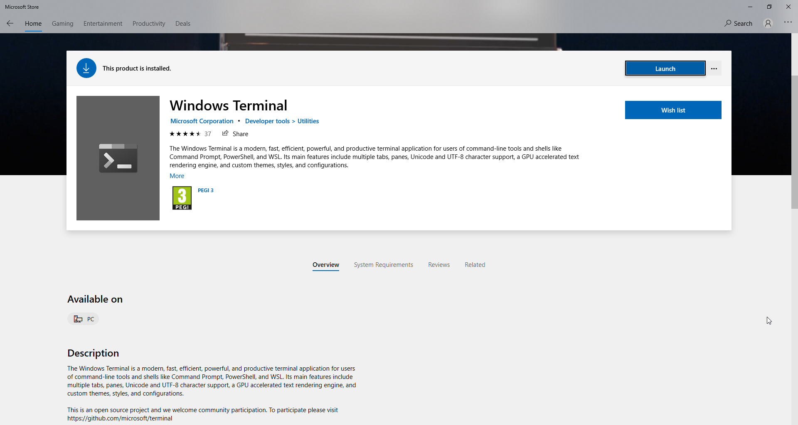
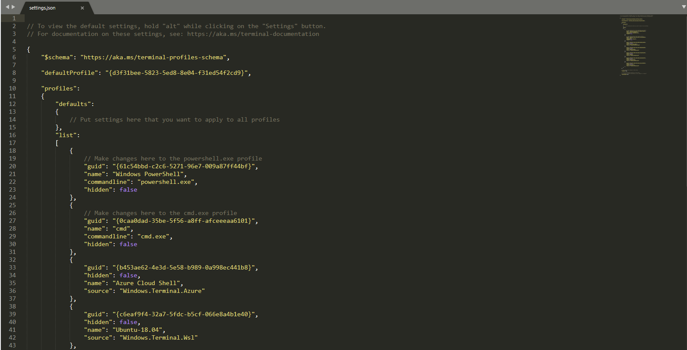
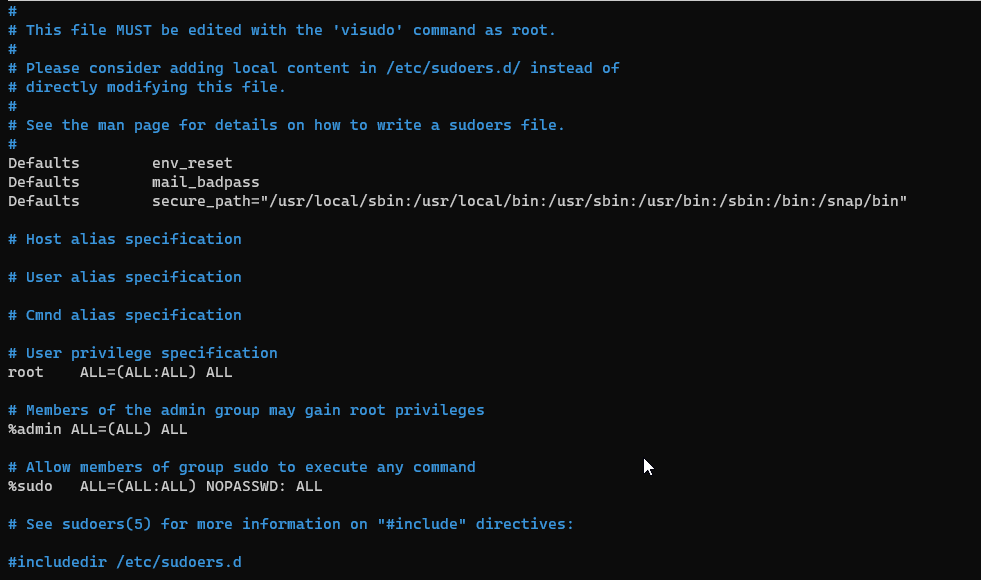
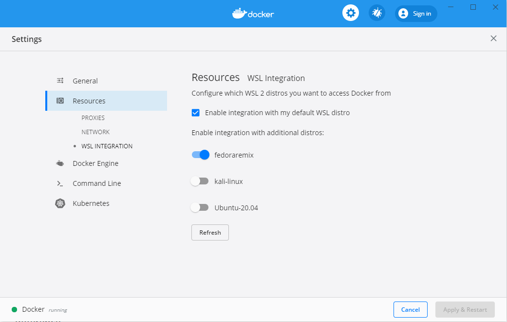

# WSL

Windows Subsystem for Linux (WSL) e' un layer di compatibilita' dove far girare tutti i binari eseguibili linux (ELF) nativamente su Windows 10 e Windows Server 2019.

Nel momento in cui scriviamo e' stata appena rilasciata la versione 2 che introduce importanti cambiamenti tra cui un Kernel Linux reale che utilizza i set di funzionalita' di Hyper-V e l'integrazione nativa con Docker Desktop.

## Setup

Prima di procedere con il setup assicurarsi di aver aggiornato windows 10 alla versione 2004 - build 19041 o superiore.

- Verificare la versione: `Settings -> System -> About`

- Abilitare la modalita' sviluppatore: `Settings -> Update & Security -> For Developers -> Developer Mode -> ON`
- Abilitare la funzionalita' WSL: `Control Panel -> Programs -> Turn Windows features on or off -> Windows Subsystem for Linux -> Checked`
- Riavviare il sistema
- Installare Ubuntu 20.04 LTS da windows store

- Avviare Ubuntu LTS dal menu di start
- Attendere il bootstrap e settare il nostro utente locale e la password
- Chiudere il dialog di Ubuntu dopo il setup
- Installare Windows Terminal da windows store

- Avviare il nuovo terminale e selezionare la voce settings
- Sostituire la stringa dentro le parentesi della chiave `defaultProfile` con il guid della nostra distro Ubuntu.

- Riavviare il terminale e verificare l'impostazione applicata
- Diventare root: `sudo su` (inserire la password che abbiamo settato poco fa)
- Setup password di root: `passwd` (per semplicita' si consiglia di inserire la medesima password dell'utente)
- Sbloccare sudo: `visudo`

- Uscire da root: `exit`
- Linkare winhome: `ln -s /mnt/c/Users/<utente> /home/<utente>/winhome`
- Aggiornare i repository: `sudo apt update`
- Aggiornare i pacchetti: `sudo apt upgrade -y`
- Installare zsh: `sudo apt install zsh`
- Spostarsi nella home: `cd ~`
- Cambiare shell dell'utente: `sudo usermod -s /bin/zsh <utente>` (es. `usermod -s /bin/zsh prossi`)
- Installare Oh-My-Zsh: `wget --no-check-certificate http://install.ohmyz.sh -O - | sh`

### Aggiornare alla versione 2 (WSL 2)

Prima di procedere e' necessario abilitare la funzionalita' "Virtual Machine Platform".

- Aprire PowerShell come amministratore: `dism.exe /online /enable-feature /featurename:VirtualMachinePlatform /all /norestart`
- Riavviare il sistema
- Aprire il terminale con l'interprete PowerShell (selezinando dal menu a tendina)
- Ottenere la lista delle distro WSL: `wsl --list --verbose`
- Configurare la distro di default: `wsl --set-default <Version>` (es. `wsl --set-default Ubuntu-20.04`)
- Aggiornare la distro alla versione 2: `wsl --set-version <Distro> 2` (es. `wsl --set-version Ubuntu-20.04 2`)

N.B. Se da errore scaricare la patch del kernel al link che viene mostrato, installarlo e ripetere l'ultimo comando.

### Installare Docker Desktop

- Registrarsi un account su Docker Hub: [https://hub.docker.com/](https://hub.docker.com/)
- Accedere al Docker Hub e scaricare Docker Desktop
- Installare Docker Desktop abilitando il supporto WSL 2
- Una volta installato andare nei settings e abilitare la nostra distro WSL di default (Ubuntu 20.04)

## Reference

- [https://docs.microsoft.com/en-us/windows/wsl/install-win10](https://docs.microsoft.com/en-us/windows/wsl/install-win10)

- [https://docs.docker.com/docker-for-windows/wsl/](https://docs.docker.com/docker-for-windows/wsl/)
