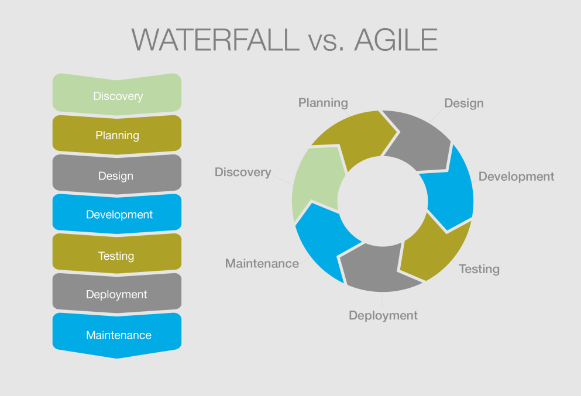
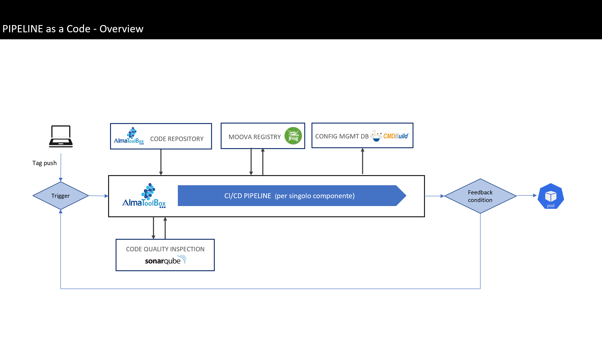

# Draft

# Premessa

Lo scopo di questo documento e’ quello di fornire strumenti utili per introdurre il lettore nel vasto mondo dello sviluppo e dell'ingegneria del software, considerando paradigmi e pattern moderni del mondo DevOps come IaC (Infrastructure as Code) e gitOps.

Questa dispensa non pretende di essere esaustiva, potrebbe includere quindi imprecisioni e/o semplificazioni di alcune tematiche, tuttavia si ritiene di aver portato alla luce gli elementi essenziali per affrontare questo "nuovo" mondo e, che i principi tratti dalla letteratura, siano non solo utili alla causa, ma giusti e necessari.

# Metodo

In genere quando ci si riferisce a metodi e tecniche di soluzione dei problemi si parla di “problem solving”, forse perché si preferisce mettere in evidenza il momento risolutorio che ci libera dallo stress del problema.
Tuttavia il problem solving viene dopo il problem setting, ed è anche meno importante dal punto di vista gerarchico. Chi pone i problemi in genere ha un potere superiore a chi li deve risolvere.

Qual'é il nostro problema? 

Una volta calato il problema sul contesto si e' proceduto con l'analisi delle possibili soluzioni.

Il metodo utilizzato lo si puo' riassumere cosi':

- Fase teorica: analisi e raccolta informazioni provenienti dal mondo esterno (cliente).
- Fase sperimentale: implementazione della soluzione tecnologica (team).

# DevOps

Che cosa e’ DevOps?

DevOps, una combinazione di sviluppo (Dev) e operazioni (Ops), è l’unione di persone, processi e tecnologia per offrire continuamente valore ai clienti.
Quali sono i vantaggi di DevOps per i team? DevOps permette a ruoli in precedenza isolati, tra cui sviluppo, operazioni IT, controllo della qualità e sicurezza, di coordinarsi e collaborare per fornire prodotti migliori e più affidabili.

## Cultura DevOps

Benché l’adozione delle procedure DevOps automatizzi e ottimizzi i processi tramite la tecnologia, tutto è basato sulla cultura interna dell’organizzazione e sulle persone che contribuiscono al lavoro. Per stabilire una cultura DevOps sono necessarie profonde modifiche al modo in cui per persone lavorano e collaborano. Quando le organizzazioni scelgono di adottare una cultura DevOps possono tuttavia creare l’ambiente per lo sviluppo di team a prestazioni elevate.

# Agile

Nell'ingegneria del software, l'espressione metodologia agile (o sviluppo agile del software, in inglese agile software development, abbreviato in ASD) si riferisce a un insieme di metodi di sviluppo del software emersi a partire dai primi anni 2000 e fondati su un insieme di principi comuni, direttamente o indirettamente derivati dai principi del "Manifesto per lo sviluppo agile del software" (Manifesto for Agile Software Development, impropriamente chiamato anche "Manifesto Agile") pubblicato nel 2001 da Kent Beck, Robert C.

I metodi agili si contrappongono al modello a cascata (waterfall model) e altri modelli di sviluppo tradizionali, proponendo un approccio meno strutturato e focalizzato sull'obiettivo di consegnare al cliente, in tempi brevi e frequentemente (early delivery/frequent delivery), software funzionante e di qualità.

Fra le pratiche promosse dai metodi agili ci sono la formazione di team di sviluppo piccoli, poli-funzionali e auto-organizzati, lo sviluppo iterativo e incrementale, la pianificazione adattiva, e il coinvolgimento diretto e continuo del cliente nel processo di sviluppo.

## Il manifesto

La gran parte dei metodi agili tenta di ridurre il rischio di fallimento sviluppando il software in finestre di tempo limitate chiamate iterazioni che, in genere, durano qualche settimana. Ogni iterazione è un piccolo progetto a sé stante e deve contenere tutto ciò che è necessario per rilasciare un piccolo incremento nelle funzionalità del software: pianificazione (planning), analisi dei requisiti, progettazione, implementazione, test e documentazione.

Anche se il risultato di ogni singola iterazione non ha sufficienti funzionalità da essere considerato completo deve essere pubblicato e, nel susseguirsi delle iterazioni, deve avvicinarsi sempre di più alle richieste del cliente. Alla fine di ogni iterazione il team deve rivalutare le priorità di progetto.

I metodi agili preferiscono la comunicazione in tempo reale, preferibilmente faccia a faccia, a quella scritta (documentazione). Il team agile è composto da tutte le persone necessarie per terminare il progetto software. Come minimo il team deve includere i programmatori ed i loro clienti (con clienti si intendono le persone che definiscono come il prodotto dovrà essere fatto: possono essere dei product manager, dei business analysts, o veramente dei clienti).
 
### Obiettivi
 
L'obiettivo è la piena soddisfazione del cliente. Il corretto uso di queste metodologie, inoltre, può consentire di abbattere i costi e i tempi di sviluppo del software, aumentandone la qualità. 

### Principi

- le persone e le interazioni sono più importanti dei processi e degli strumenti (ossia le relazioni e la comunicazione tra gli attori di un progetto software sono la miglior risorsa del progetto);
- è più importante avere software funzionante che documentazione (bisogna rilasciare nuove versioni del software ad intervalli frequenti, e bisogna mantenere il codice semplice e avanzato tecnicamente, riducendo la documentazione al minimo indispensabile);
- bisogna collaborare con i clienti oltre che rispettare il contratto (la collaborazione diretta offre risultati migliori dei rapporti contrattuali);
- bisogna essere pronti a rispondere ai cambiamenti oltre che aderire alla pianificazione (quindi il team di sviluppo dovrebbe essere pronto, in ogni momento, a modificare le priorità di lavoro nel rispetto dell'obiettivo finale).

In sintesi, il Manifesto Agile, sottolinea l'importanza dei su citati principi fermo restando il valore di processi, strumenti, documentazione, contratti e pianificazione.

### Pratiche

Le singole pratiche applicabili all'interno di una metodologia agile sono decine e dipendono essenzialmente dalle necessità dell'azienda e dall'approccio del project manager. Nella scelta però bisogna tenere conto delle caratteristiche di ogni pratica per i benefici che apporta e le conseguenze che comporta. Ad esempio, in Extreme Programming, si supplisce alla mancanza assoluta di qualsiasi forma di progettazione e documentazione con lo strettissimo coinvolgimento del cliente nello sviluppo e con la programmazione in coppia.

Introduzione al framework scrum: [Link Slide](https://www.slideshare.net/GiulioRoggero/introduzione-a-scrum-53424608)

# Git

Git è un software di controllo versione distribuito utilizzabile da interfaccia a riga di comando, creato da Linus Torvalds nel 2005.

Git nello slang americano significa idiota proprio' perche' il suo sviluppatore lo ideo' come strumento semplice per versionare il sorgente del Kernel Linux che nei primi anni 2000 era diventato un progetto oramai assodato.

Oggi è il software di versionamento più diffuso grazie alla sua semplicita' di utilizzo e la sua efficacia.

In ottica DevOps e' considerato lo strumento di partenza su cui si basano i piu' moderni paradigmi del design del software e delle architetture, quali "infrastructure as a code" e "gitops" che affiancati alla metodologia Agile si dimostrano sempre piu' efficaci e affidabili.

Le sue peculiarita' di essere semplice lo rendono certamente utile e comodo e allo stesso tempo uno strumento letale e pericoloso.

Per far in modo che questo strumento ci sia sempre utile e che non ci venga mai contro e' necessario chiarire bene il suo principio di funzionamento e applicare alcune best practice che dopo la sua larga diffusione sono diventate standard e vengono identificate con il termine "Git Flow".

E' fortemente consigliato, sopratutto se siamo agli inizi, utilizzare Git a riga di comando proprio per la sua natura per acquisire padronanza con lo strumento e capire meglio tutte le sue funzionalita'.

## Basics

Di seguito elenchiamo i comandi base con la loro descrizione.

- Inizializzare una directory come repository: `git init`
- Visualizzare lo stato attuale: `git status`
- Aggiungere i file aggiunti e/o modificati in stage area: `git add .`
- Commit rapido: `git commit -m "Messaggio"`
- Commmit esteso (scelta consigliata): `git commit`
- Clonare un repository: `git clone git@github.com:<project-namespace>/<repo-name>.git`
- Eliminare un remote: `git remote rm <remote-alias>` es. `git remote rm origin`
- Aggiungere un remote: `git remote add origin git@github.com:<project-namespace>/<repo-name>.git`
- Spostarsi di branch: `git checkout <branch-name>` es. `git checkout sviluppo`
- Creare un branch: `git checkout -b <branch-name>` es. `git checkout -b feature-customers`
- Push dei commit: `git push origin <branch-name>` es. `git push origin feature-customers`
- Pull dei commit: `git pull origin <branch-name>` es. `git pull origin feature-customers`
- Pull dei tags: `git pull origin --tags`
- Visualizzare la differenza delle modifiche: `git diff`
- Visualizzare la log history: `git log` 
- Modificare il commit piu' recente: `git commit --amend`

### Flusso base

- Fetchare le modifiche: `git fetch --all`
- Pullare le modifiche: `git pull origin <branch-name>`
- Visualizzare lo stato: `git status`
- Aggiungere i file: `git add .`
- Visualizziamo lo stato: `git status`
- Commit delle modifiche: `git commit`
- Push dei commits: `git push origin <branch-name>`

N.B. Quando si aggiungono i file in stage con il comando `git add .` ricordarsi di essere sempre nella root del repository git.

# Pipeline

Il concetto di pipeline (in inglese, tubatura — composta da più elementi collegati — o condotto) viene utilizzato per indicare un insieme di componenti software collegati tra loro in cascata, in modo che il risultato prodotto da uno degli
elementi (output) sia l’ingresso di quello immediatamente successivo (input).
Quindi possiamo dire che una pipeline devops estende il concetto base, ossia un software composto da piu’ step (tubi) per l’automazione di flussi e processi.
Pertanto la pipeline devops e’ da intendere come un software a tutti gli effetti.

Le tipologie di pipeline devops sono differenti, le piu’ note sono:
- Continuos Integration (CI)
- Continuous Delivery (CD)
- Continuos Integration and Continuous Delivery (CI/CD) • gitOps CI/CD
- gitOps IaC
- gitOps end-to-end
- noOps CI/CD
- noOps IaC
- noOps end-to-end

# Glossario

## Git Flow

Il Git Flow e' il piu' popolare tra i "Branch Strategy" mirato a semplificare il release management introdotto dallo sviluppatore Vincent Driessen nel 2010.

Il Git Flow consiste nell'isolare il lavoro utilizzando differenti tipologie di branch o rami.

In linea generale il Git Flow utilizza dei branch contenitori come i branch develop, staging e release che rappresentano uno stato preciso dell'ambiente e dei branch di funzionalita' chiamati _Feature Branch_ utilizzati per lo sviluppo delle singole funzionalita' o feature.

Di norma il branch develop e' il branch principale che rappresenta l'unione di tutte le feature e dunque lo stato corrente della versione di sviluppo. Da questo branch vanno infatti staccati i cosidetti _Feature Branch_ che dovranno rappresentare in modo atomico ognuno una singola feature.

Una volta che la feature viene completata questa deve essere mergiata sul branch develop, comunemente aprendo una Pull Request e facendosi fare una code review da un altro sviluppatore.

Quando il contenuto mergiato nel branch develop risulta funzionante e approvato ad una prima review viene mergiato sul branch dell'ambiente di destinazione.

Normalmente il primo ambiente di destinazione dopo sviluppo e' staging (ambiente di test o collaudo), dunque viene mergiato il branch develop sul branch staging.

Una volta testato si passa al merge finale sul branch dell'ambiente di produzione o rilascio, normalmente il branch master o main.
Inoltre possiamo avere un'ulteriore separazione tra il master branch e un altro branch denominato realease per rappresentare la versione definitiva e testata della nostra codebase, branch utilizzato spesso per derivare i tag annotati che definiscono di fatto la release con la semantica classica x.y.z (es. 1.0.0)

Infine abbiamo i branch hotfix dedicati alle correzioni rapide nell'ambiente di produzione comunemente derivati direttamente dal branch master o main.

### Vantaggi

- Ottimo per un flusso di lavoro software basato sul rilascio, in quanto presenta una staging area per tutti gli sviluppi che non sono ancora stati sviluppati (Develop).
- Gitflow offre un canale dedicato per le correzioni rapide nell'ambiente di produzione (Hotfix).
- Aumentare la collaborazione: le feature branches permettono a più sviluppatori di lavorare su una singola feature, in quanto essa agisce come una sandbox e tutti gli sviluppi vengono effettuati affinché la stessa venga portata in produzione. Ciò permette anche di verificare il lavoro svolto dai singoli sviluppatori su una feature.
- Sviluppare in parallelo: i nuovi sviluppi sono organizzati in feature branches e vengono merged (cioè accorpati) nel codice principale solo quando il team reputa che sia pronto per il rilascio. Ciò permette di cambiare task senza problemi.
- Se il team e' popolato principalmente da Junior Developers si ha una via standard per controllare il loro lavoro da vicino, dare loro feedback per migliorare le skills e prevenire i bug e il deterioramento della qualita' del codice.

### Svantaggi

- Richiede vari steps di review e quindi almeno una risorsa occupata a controllare i singoli merge.
- Puo' risultare molto macchinosa in alcuni contesti dove il team e' piccolo (1-2 persone) e la complessita' software e' gia' ridotta come nel caso dei micro servizi o librerie.
- Puo' risultare complesso da associare a meccanismi di automazione come le pipeline del mondo DevOps.
- Se il team e' popolato principalmente da Senior Developers conviene ridurre il micro-management e quindi si puo' alleggerire un sistema molto "Burocratico".

N.B Il Git Flow a sua volta ha dato origine a varie declinazioni come il Gitlab Flow o il GitHub Flow che, pur basandosi sui medesimi concetti di base, presentano alcune variazioni.

## Trunk Based Development (TBD)

Il Trunk-based development e' una pratica per la gestione e il versionamento del codice dove gli sviluppatori mergiano piccoli, ma frequenti aggiornamenti sul core branch denominato Trunk (branch master).

Lo scopo di questa pratica e' minimizzare il flusso di lavoro degli sviluppatori e agevolare le integrazioni con strumenti di automazione come le pipeline DevOps.

### Vantaggi

- Ottimo per Minimum Viable Product (MVP).
- Nativamente supportato dalla maggior parte dei tool DevOps per l'automazione dei tests e rilasci.
- Ideale nei team Agile (Scrum/Kanban), in quanto costringe meeting continui per fare una review seguendo il modello dello sprint review.
- Idoneo per lo sviluppo e gestione di micro-servizi e librerie sopratutto se il team e' composto da pochi sviluppatori (1-2 persone).
- Adatto in generale quando i team sono piccoli e i membri del team sono principalmente Senior Developers.
- Scalabile orizzontalmente a livello di team, ossia possiamo creare N progetti Trunk Based e dedicare a ognuno solo 1-2 sviluppatori, comodo in architetture basate sui micro-services.

### Svantaggi

- Risulta difficile scalare a livello di feature in quanto questo modello si adatta meglio su sviluppi gia' minimizzati come i micro-servizi e/o le librerie.
- Non scalabile verticalmente a livello di team, se il team che lavora al progetto Trunk Based cresce a dismisura risulta a un certo punto impossibile gestire i conflitti.
- Se il team e' popolato principalmente da Junior Developers risulta difficile controllare cosa stanno facendo e dare loro feedback.

## GitOps

GitOps è una serie di procedure per la gestione delle configurazioni di applicazioni e infrastrutture basata su Git, un sistema di controllo delle versioni open source. GitOps utilizza Git come singola fonte di attendibilità per le applicazioni e l'infrastruttura dichiarativa.

Per iniziare a utilizzare GitOps occorre un'infrastruttura gestibile in modo dichiarativo. Per questo motivo, GitOps viene spesso utilizzato come modello operativo per Kubernetes e per lo sviluppo di applicazioni cloud native. Inoltre, consente il deployment continuo per Kubernetes.

Kubernetes non costituisce tuttavia un requisito per l'utilizzo di GitOps. La tecnica GitOps può essere applicata anche ad altre pipeline di deployment e infrastrutture.

Nel caso specifico delle "Pipeline as Code" applichiamo questa tecnica come un pattern e/o paradigma indicando il repository git come singola fonte di verità. 

Inoltre indichiamo che tutte le operazioni automatizzate (pipeline) vengono sempre e comunque gestite e triggerate da un unico strumento; Git.

In questo caso possiamo quindi definire la nostra architettura come git centrica.

## Infrastructure as Code (IaC)

Con Infrastructure as Code (IaC) intendiamo un approccio alla gestione e al provisioning dell'infrastruttura che avviene tramite codice anziché con processi manuali.

I file di configurazione creati con l'IaC contengono le specifiche dell'infrastruttura e semplificano la modifica e la distribuzione delle configurazioni. Questa soluzione garantisce la ripetibilità del provisioning dello stesso ambiente. Codificando e documentando le specifiche della configurazione, l'IaC facilita la gestione della configurazione e permette di evitare eventuali modifiche ad-hoc non documentate.

Nel caso specifico delle "Pipeline as Code" applichiamo questa tecnica come un pattern e/o paradigma, individuando i file descrittori yaml di kubernetes come codice infrastrutturale.

Questo significa che una qualunque modifica di questi ultimi dovra' essere considerata come una modifica del codice sorgente a cui dovra' seguire un tag con incremento di versione.

# Fonti

## DevOps

* https://azure.microsoft.com/it-it/overview/what-is-devops/#devops- overview
* https://www.redhat.com/it/topics/devops
* [https://azure.microsoft.com/it-it/overview/what-is-devops/#devops-overview](https://azure.microsoft.com/it-it/overview/what-is-devops/#devops-overview)
* [https://www.redhat.com/it/topics/devops](https://www.redhat.com/it/topics/devops)

## Pipeline

* [https://it.wikipedia.org/wiki/Pipeline_software](https://it.wikipedia.org/wiki/Pipeline_software)
* [https://www.redhat.com/it/topics/devops/what-cicd-pipeline](https://www.redhat.com/it/topics/devops/what-cicd-pipeline)
* [https://docs.microsoft.com/it-it/azure/architecture/example-scenario/apps/devops-dotnet-webapp](https://docs.microsoft.com/it-it/azure/architecture/example-scenario/apps/devops-dotnet-webapp)

## Git Flow
- [https://www.gitkraken.com/learn/git/git-flow](https://www.gitkraken.com/learn/git/git-flow)
- [https://www.atlassian.com/it/git/tutorials/comparing-workflows/gitflow-workflow](https://www.atlassian.com/it/git/tutorials/comparing-workflows/gitflow-workflow)
- [https://dreams.news/articles/git-flow-cos-e-e-come-funziona](https://dreams.news/articles/git-flow-cos-e-e-come-funziona)

## Trunk Based Development (TBD)
- [https://trunkbaseddevelopment.com/](https://trunkbaseddevelopment.com/)
- [https://www.atlassian.com/continuous-delivery/continuous-integration/trunk-based-development](https://www.atlassian.com/continuous-delivery/continuous-integration/trunk-based-development)
- [https://blexin.com/it/blog/diciamo-addio-alle-pr-con-il-trunk-based-development/](https://blexin.com/it/blog/diciamo-addio-alle-pr-con-il-trunk-based-development/)
- [https://www.toptal.com/software/trunk-based-development-git-flow](https://www.toptal.com/software/trunk-based-development-git-flow)

## GitOps
- [https://www.redhat.com/it/topics/devops/what-is-gitops](https://www.redhat.com/it/topics/devops/what-is-gitops)

## Infrastructure as Code (IaC)
- [https://www.redhat.com/it/topics/automation/what-is-infrastructure-as-code-iac](https://www.redhat.com/it/topics/automation/what-is-infrastructure-as-code-iac)

# Bibliografia

* F. Mora, "DevOps: Guida per integrare Development e Operations e produrre software di qualita'", 2019
* Robert C. Martin: "Clean architecture. Guida per diventare abili progettisti di architetture software", 2018
* A. Stellman, J. Greene: "Learning Agile: Understanding Scrum, XP, Lean, and Kanban", 2014
* E. Gamma, R. Helm, R. Johnson, J. Vlissides: "Design Patterns: Elements of Reusable Object-Oriented Software", 1994

# Note

- Cultura DevOps
- Metodologia DevOps
- Strumenti DevOps
- Agile
- Pipeline as Code
- Automated Tests (lint, unit tests, QA, integration tests, security analysis,
security scanning, penetration tests, load tests, end-to-end)
- Infrastructure as Code (IaC)
- Mutable IaC
- Immutable IaC
- Configuration Management (CM)
- gitOps
- noOps Pipeline
- Monitoring e Alerting
- Backup and Restore
- Security Assessment
- Comunicazione