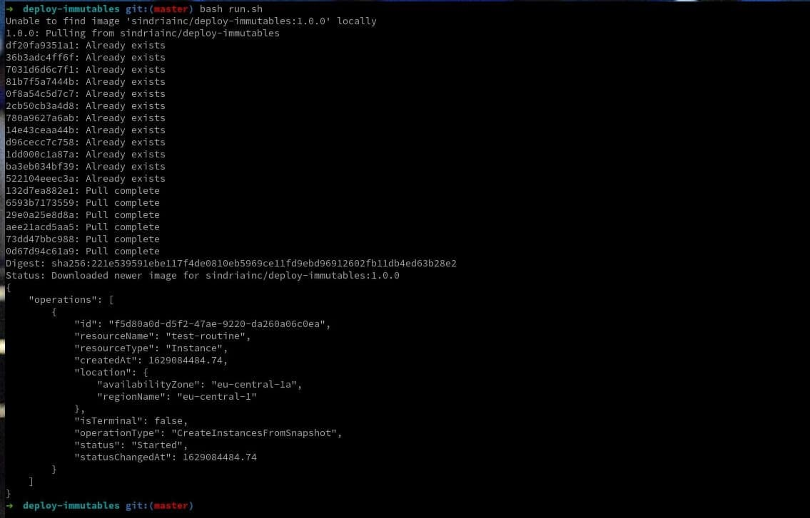

# Deploy Immutables

This IaC component permit parallel deployment of immutable resources.

This is atomic routine for any CI/CD such as gitlab-ci, bitbucket-pipelines etc.
In any case is possible to use it manually with run.sh helper script.

## Configuration

List of required envs. This envs will be set on your pipeline variables or in your .env file for manual usage.

| Key                       | Value                         |
| --------------------------|:-----------------------------:|
| AWS_ACCESS_KEY_ID         | <access-key>                  |
| AWS_SECRET_ACCESS_KEY     | <secret-key>                  |
| AWS_DEFAULT_REGION        | eu-central-1                  |
| IAC_MODE                  | <mode>                        |
| IAC_GIT_USERNAME          | <service-account-username>    |
| IAC_GIT_PASSWORD          | <service-account-username>    |
| IAC_GIT_PROVIDER          | <provider-fqdn>               |
| IAC_GIT_NAMESPACE         | <repo-namespace>              |
| IAC_INFRA_NAME            | <repo-slug>                   |
| IAC_LIVE_CACHE            | <bucket-name>                 |
| IAC_CURRENT_INFRA         | <bucket-name>                 |
| IMMUTABLE_NAME            | <resource-name>               |
| IMMUTABLE_REFER           | <blueprint-name>              |
| IMMUTABLE_TYPE            | <resource-type>               |
| IMMUTABLE_BUNDLE          | <resource-bundle>             |
| IMMUTABLE_ZONE            | <cloud-provider-zone>         |

## Usage

Paste this command in your pipeline step:

`docker run --rm -t --env IAC_MODE=${IAC_MODE} --env AWS_ACCESS_KEY_ID=${AWS_ACCESS_KEY_ID} --env AWS_SECRET_ACCESS_KEY=${AWS_SECRET_ACCESS_KEY} --env AWS_DEFAULT_REGION=${AWS_DEFAULT_REGION} --env IAC_GIT_USERNAME=${IAC_GIT_USERNAME} --env IAC_GIT_PASSWORD=${IAC_GIT_PASSWORD} --env IAC_GIT_PROVIDER=${IAC_GIT_PROVIDER} --env IAC_GIT_NAMESPACE=${IAC_GIT_NAMESPACE} --env IAC_INFRA_NAME=${IAC_INFRA_NAME} --env IAC_LIVE_CACHE=${IAC_LIVE_CACHE} --env IAC_CURRENT_INFRA=${IAC_CURRENT_INFRA} --env IMMUTABLE_NAME=${IMMUTABLE_NAME} --env IMMUTABLE_REFER=${IMMUTABLE_REFER} --env IMMUTABLE_TYPE=${IMMUTABLE_TYPE} --env IMMUTABLE_BUNDLE=${IMMUTABLE_BUNDLE} --env IMMUTABLE_ZONE=${IMMUTABLE_ZONE} sindriainc/deploy-immutables:1.0.0`

OR use the helper script:

`bash run.sh`

IMPORTANT: `Remeber to set all envs in your .env file before run.`

### Tips and Tricks

For standalone usage you can override deployments.yaml configuration with volume. Append this to command above:

`-v ./config:/var/www/app/config`

## Setup Development Environment

- Clone this repo: `git clone git@github.com:SindriaInc/deploy-immutables.git`
- Move into it: `cd deploy-immutables`
- Build local image: `bash build.sh sindriainc/deploy-immutables local`
- Setup env: `cp .env.local .env`
- Setup docker compose: `cp docker-compose.local.yml docker-compose.yml`
- Start environment: `docker-compose up -d`
